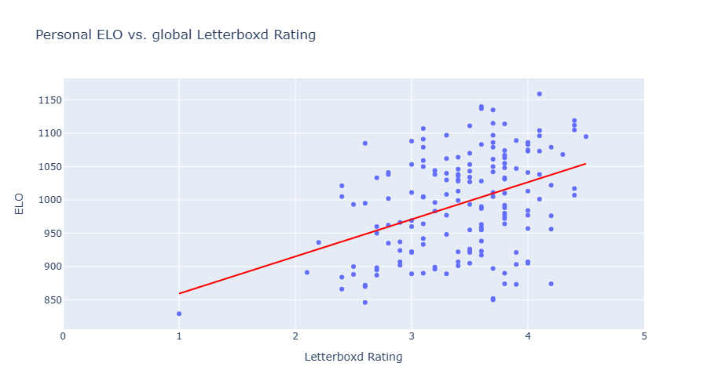
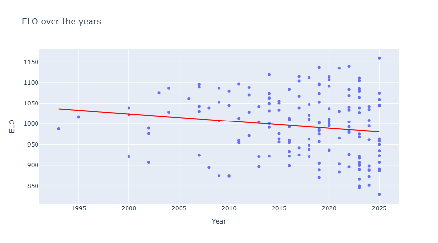

# **ELO media ranker**
## **Intuitive terminal-based movie/show/album ranker**
ELO Media Ranker uses the ELO rating system, a method for ranking players in games like chess, to score and compare movies, shows, albums, songs, etc. based on your matchups. The program saves the inputs and scores to a `.csv` file.

### **Functions:**
- Add a new item and play five matches against others to determine its ELO rating
- Let every existing item play a randomly selected match
- Choose two items to decide between
- See correlation between items' personal ELO and year of release or global score
---
### **Example usage:**
```
[1]: Add a new item
[2]: Decide between existing items
[3]: Choose own matchup by indexes
[4]: Ranked mode
[0]: Quit
> 1
Item name:
> Get Out
Release year of Get Out:
> 2017
Letterboxd rating for Get Out:
> 4.1
Placement matchup:
[1]: Get Out < 0.5 >
[2]: Creed < 0.5 >
[0]: Tie
> 
```
etc.

---
### **Example graphs:**



---
### **Setup**
Requires `Python 3.x` and the following packages:
- `pandas`
- `plotly`

Installation: `pip install pandas plotly`

Then run `main.py` to start.

Open `analysis.ipynb` and select *Run All* to generate graphs and your top 10.


---
Change `GENERAL_SCORER` and `GENERAL_SCORE_SCALE` in `variables.py` to select another rating system. Example:
```
GENERAL_SCORER = "Rotten Tomatoes"
GENERAL_SCORE_SCALE = [0, 100]
```

---
